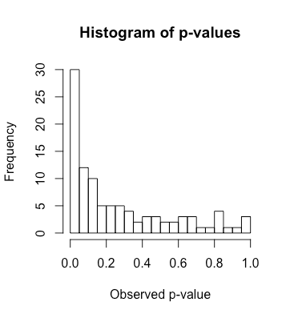

```{r setup, include=FALSE}
knitr::opts_chunk$set(echo = FALSE)
```

## Course Instructor
<div class="columns-2">

- Curtis Phills, PhD
- Office: 51/3429
- Email: curtis.phills@unf.edu
- Office Hours: T/R noon to 3 pm
- Course Website: Canvas


</div>

## Expectations
> - Class begins and ends on time
> - Listen to each other with respect and trust
> - Invest in your own learning
> - Participate actively in your learning

## Today you will have the opportunity to:
> - Identify some of the tools psychologists use to conduct research and communicate findings
> - Define what you want to learn

## Agenda
> - Class structure
> - What makes a study convincing?
> - The Scientific Method
> - Transparent Science

## Class Format
- Each class will usually consist of:
    - lecture
    - discussion
    - group/individual work
    - maybe a video

## Course Textbook
- No textbook!
- But I recommend:
    - [R for Data Science: r4ds.had.co.nz](https://www.amazon.com/R-Data-Science-Hadley-Wickham/dp/1491910399/ref=as_li_ss_tl?ie=UTF8&qid=1469550189&sr=8-1&keywords=R+for+data+science&linkCode=sl1&tag=devtools-20&linkId=6fe0069f9605cf847ed96c191f4e84dd)
    - [Writing Science by Joshua Schimel](https://www.amazon.com/Writing-Science-Papers-Proposals-Funded/dp/0199760241/ref=sr_1_3?ie=UTF8&qid=1534241813&sr=8-3&keywords=writing+science)
    - [Ten simple rules for structuring paper by PLOS Computational Biology Staff](https://doi.org/10.1371/journal.pcbi.1005619)
    - [Writing for Psychology by Mark Mitchell and colleagues](https://www.amazon.com/Writing-Psychology-Mark-L-Mitchell/dp/1111840636/ref=sr_1_1?ie=UTF8&qid=1534242058&sr=8-1&keywords=writing+for+psychology)
    
## Goals of this course
- At the end of this course you will be able to:
    - Critically evaluate social psychological research.
    - Integrate your unique hypotheses with relevant published research.
    - Design and build an experiment using modern tools.
    - Recruit participants while protecting their rights as human subjects.
    - Use data analysis software to evaluate social psychological research outcomes. 
    - Report your research results in an oral presentation and in written form in accordance with APA guidelines. 
    
## Assignments
|Assessment        |Group/Individual|Points|
|:-----------------|:--------------:|:----:|
|Class Notebooks   |Individual      |60    |
|Online Homework   |Individual      |50    |
|Review Exam       |Individual      |50    |
|CITI Certification|Individual      |50    |
|1st Qualtrics     |Individual      |10    |
|Project Prep      |Individual      |40    |
|Project Prep      |Group           |110   |
|Final Paper       |Individual      |100   |
|Final Presentation|Individual      |50    |

## Grading Scheme
|Letter Grade|Grading Scale (%)|
|:----------:|:---------------:|
|A           |90-100           |
|B+          |87-89            |
|B           |80-86            |
|C+          |77-79            |
|C           |70-76            |
|D           |60-69            |
|F           |00-59            |

## What makes a study convincing?
> - low p-value
> - lots of participants 
> - probability sample 
> - preregistration 
> - replication
> - can check the data myself

## Write down everytime someone is surprised
<video width="700" controls>
  <source src="What is surprising.mp4" type="video/mp4">
Your browser does not support the video tag.
</video>

## When are we surprised?
> - When an assumption is violated

## What is a p-value?
> - A p-value represents how surprising the data is, assuming the null hypothesis is true

## What is a p-value?
> - A p-value represents how surprising the data is, assuming the null hypothesis is true
> - **Null hypothesis:** Harry is not a wizard
> - **Alternative hypothesis:** Harry is a wizard
> - **Data**: Hagrid told Harry he is a wizard. 
> - Should we reject the null hypothesis? How surprising is this data, assuming Harry is not a wizard.

## What is a p-value?
> - A p-value represents how surprising the data is, assuming the null hypothesis is true
> - A p-value is significant when it is less than .05
> - In your mind, switch the word ‘significant’ to ‘surprising, assuming the null hypothesis is true’
> - A p-value is the probability of seeing data as or more extreme than the current data, assuming the null hypothesis is true.

## My p-value is less than .05
- Does this mean there is a 95% probability the alternative hypothesis is true?

## What is a p-value?
> - A p-value represents how surprising the data is, assuming the null hypothesis is true
> - Scientists use an alpha level to decide whether to reject the null hypothesis. It is usually set to p < .05.
> - This does not mean there is a 95% chance the alternative hypothesis is correct.
> - In fact, we never know if we were correct in rejecting the null hypothesis.
> - We just know that in the long run if we set our alpha level to p < .05, we’ll never be wrong more than 5% of the time.

## Flip a coin!
- Or ask your phone to

## What is an effect size?
> - The magnitude of an effect

## Are women more extraverted than men?


## Do women report more negative affect than men?


## Are women more agreeable than men?


## Think-Pair-Share
- **Are women better coders than men?**
- Break into groups of 4-6
- Write your names and n-numbers on a piece of paper
- **Women are better coders than men: p < .05, d = .04**
- Imagine a man and a woman have applied to be a coder for your business. Would you automatically hire the woman? How much more likely would you want a randomly selected woman to be better at coding before you would use gender as a basis for hiring a coder?
- Once your group has reached consensus, hand in your answers to the three questions.

## What is statistical power?
> - Assuming the null hypothesis is false, what is the probability the p-value will be less than .05?

## What is statistical power?
> - Assuming the null hypothesis is false, what is the probability the p-value will be less than .05?
> - related to effect size and sample size
> - Statistical power increases when you have a larger sample
> - Statistical power increases when you have a larger effect
> - Rule of thumb is to aim for 80% power

## P-values and sample sizes
<div style="float: left; width: 50%;">

- Group A: M = 100
- Group B: M = 106
- (there is a real difference between these 2 groups)
- 20 participants in each group
- What is the p-value?

</div>
<div style="float: right; width: 50%;">


</div>

## P-values and sample sizes
<div style="float: left; width: 50%;">

- Group A: M = 100
- Group B: M = 106
- (there is a real difference between these 2 groups)
- 30 participants in each group
- What is the p-value?

</div>
<div style="float: right; width: 50%;">



</div>

## P-values and sample sizes
<div style="float: left; width: 50%;">

- Group A: M = 100
- Group B: M = 106
- (there is a real difference between these 2 groups)
- 50 participants in each group
- What is the p-value?

</div>
<div style="float: right; width: 50%;">


</div>

## P-values and sample sizes
<div style="float: left; width: 50%;">

- Group A: M = 100
- Group B: M = 106
- (there is a real difference between these 2 groups)
- 100 participants in each group
- What is the p-value?

</div>
<div style="float: right; width: 50%;">


</div>

## What does a p-value tell us?

## Optional Stopping
<div style="float: left; width: 50%;">

- This is a how a p-value changes as you add more participants.

- This represents the case where the null hypothesis is true.

</div>
<div style="float: right; width: 50%;">


</div>

## What does a p-value tell us?
- To answer this we need to know:
    - How many tests conducted
    - How many participants

## The Scientific Method {.build}


<div class="circle-text">Design</div>
<div class="circle-text" >Collect</div>
<div class="circle-text" >Analyze</div>

<div class="circle-text-newline">Analyze</div>
  
<div class="circle-text-newline">Analyze</div>
  
<div class="circle-text" >Publish! </div>


## The Scientific Method {.build}


<div class="circle-text">Design</div>
<div class="circle-text" >Collect</div>
<div class="circle-text" >Analyze</div>

<div class="circle-text-newline2">Design</div>
<div class="circle-text" >Collect</div>
<div class="circle-text" >Analyze</div>

<div class="circle-text-newline2">Design</div>
<div class="circle-text" >Collect</div>
<div class="circle-text" >Analyze</div>
<div class="circle-text" >Publish! </div>

## QRPs, HARKING, and P-Hacking
QRP
:    Questionable Research Practice

- Almost 1/4 of American Psycholgists have used a QRP in the last 12 months (<https://psyarxiv.com/3v7hx/>)

HARKING
:    Hypothesizing after results known  


p-hacking
:    another phrase to describe a questionable research practice but usually with a focus on obtaining a significant p-value

## Preregistration

<iframe width="560" height="315" src="https://www.youtube.com/embed/LYfZr5poCkQ" frameborder="0" allow="autoplay; encrypted-media" allowfullscreen></iframe>

## Preregistration
- Register details of a study beforehand so you don’t exercise researcher degrees of freedom later
- Design
- Sample size/Stopping rule
- Analysis Plan and exclusion rules

## External Validity
- The extent to which results of a study can be generalized to other populations and settings
- Exact replication: generalize to other labs
- Conceptual replication: generalize to other operationalizations of variables
- Other populations
- Other experimenters
- Replication plus extension: researchers replicate original study but add variables to test additional questions

## Replication vs. Reproduction
Replication
:    If I re-run your experiment, do I get the same results?

- About 35% of Social Psychology experiments replicate

Reproduction
:    If I re-analyze your data, do I get the same results?

In the journal cognition:

- About 78% of data is available to be re-analyzed
- About 60% of data is actually usable
- Of 35 articles selected for a test:
    - 11 could be reproduced
    - 11 more could be reproduced with help from the authors
    - 13 articles  not be reproduced even with author help

## Why is replication important to the scientific method?
- <http://curatescience.org>

## The Scientific Method {.build}

<div class="circle-text">Design</div>
<div class="circle-text" >Collect</div>
<div class="circle-text" >Analyze</div>
<div class="circle-text-emphasis" >Replicate</div>

## Ego Depletion
> - Willpower is like a muscle. It gets tired as you use it. So you have less willpower and doing a task that requires willpower.
> - Haggar et al., 2010: Meta-analysis of 83 studies finds evidence for ego depletion (d = .63—medium)
> - Carter & McCullough (2014): Another meta-analysis but correcting for small study effects (d = 0)
> - Haggar et al., 2016: Many labs study (23 labs), 2141 participants. Ego depletion is a small effect (d ~= 0).

## Open Science

<iframe width="560" height="315" src="https://www.youtube.com/embed/1rFWeTryiW4" frameborder="0" allow="autoplay; encrypted-media" allowfullscreen></iframe>

## Open Science

- Benefits:
    - This is what people think science is anyway
    - make science more democratic and more meritocratic
    
- Solves:
    - More people can be involved. More collaboration, more sharing of data and materials
    - helps science to self-correct
    
- Cons:
    - Takes more time initially
    - (but saves time in the long run by making data and materials available)

## What makes a study convincing?
> - low p-value?
> - No QRPs, p-hacking, or HARKING
> - open science practices
> - replication
> - reproducibility
> - construct, internal, external, and statistical validity

## Next week
- Set up research teams!
- Check Canvas for updates and assignments
